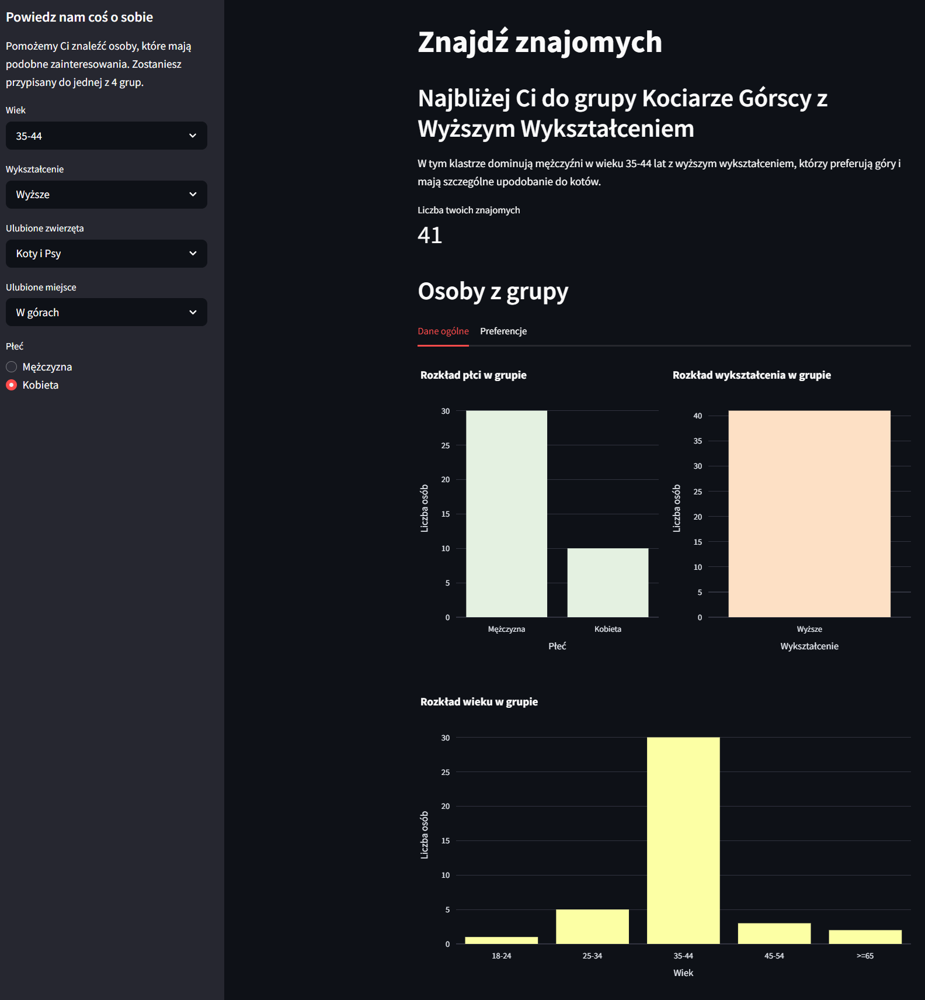
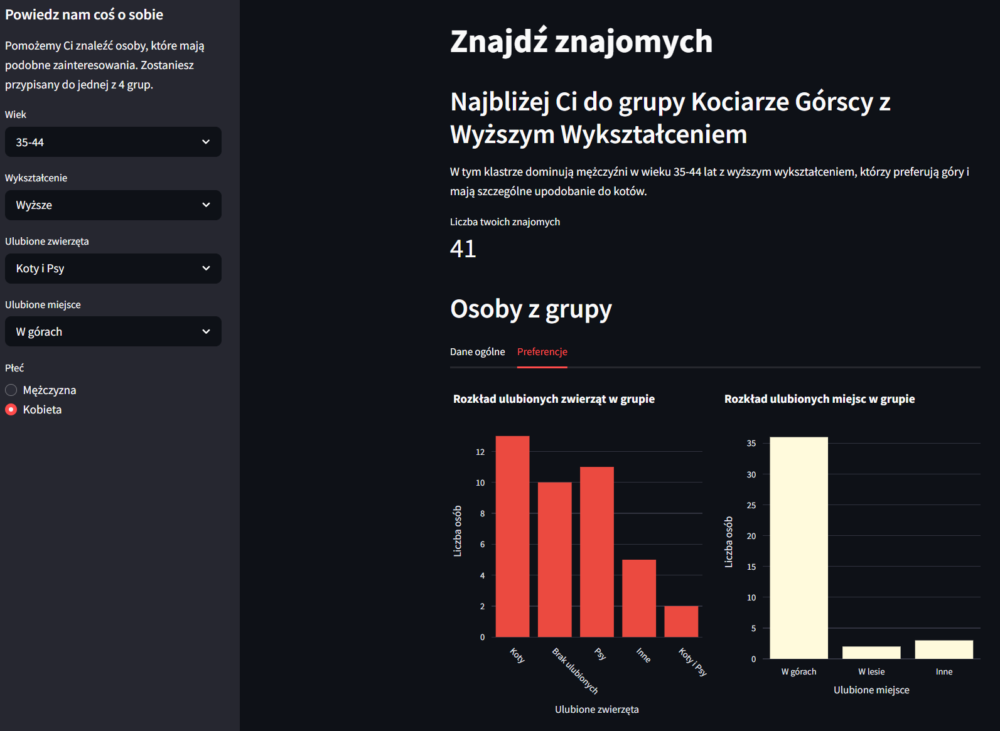

# Ankieta

Aplikacja pozwala na **znalezienie znajomych o podobnych preferencjach** na kursie z Data Science. Zadaniem użytkownika jest wypełnienie informacji o sobie, tj. **wiek**, **wykształcenie**, **ulubione zwierzę**, **ulubione miejsce** oraz **płeć**. Na podstawie zebranych danych model przypisuje użytkownika do jednej z 4 grup:  
<ul style="list-style-type: none; padding-left: 20px;">
<li>1. Kociarze Górscy z Wyższym Wykształceniem;</li>
<li>2. Leśni Entuzjaści Psów z Wyższym Wykształceniem;</li>  
<li>3. Miłośnicy Wody i Psów z Wyższym Wykształceniem;</li>  
<li>4. Młodsi Miłośnicy Gór i Psów ze Średnim Wykształceniem.</li>  
</ul>  

Model został wytrenowany na próbie liczącej **229 przypadków**. W pierwszej zakładce aplikacja pokazuje wykresy z **danymi ogólnymi** (rozkład płci, wieku, wykształcenia) dotyczącymi osób z danej grupy. W drugiej zakładce ukazane są rozkłady **preferencji** - tzn. ulubione zwierzę, ulubione miejsce.  

**Link do aplikacji:** [Otwórz aplikację](https://ankieta-justyna.streamlit.app/)  
  
Przykładowe zrzuty ankiety:  
  
  
  

- **ESTETYCZNA** o przyjaznym interfejsie
- **SZYBKA** użytkownik natychmiast otrzymuje wynik

