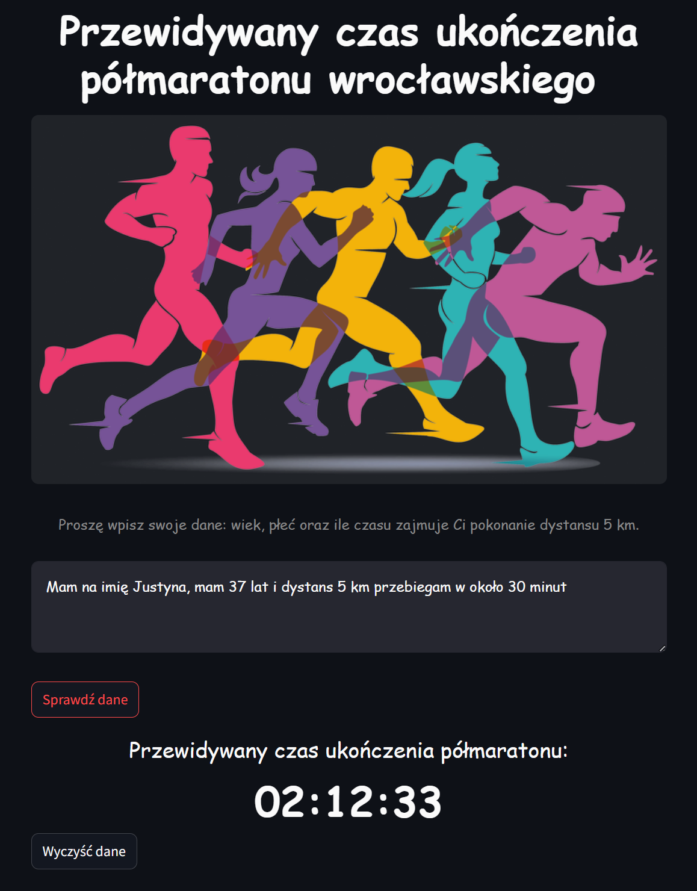
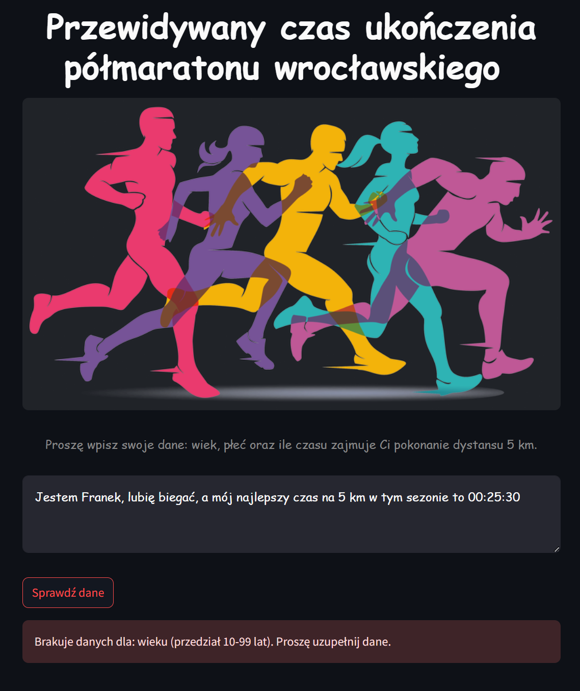

# Biegacz

Aplikacja pozwala **oszacować czas ukończenia półmaratonu wrocławskiego**. Użytkownik musi wprowadzić swoje dane: **wiek**, **płeć** oraz **czas w jakim pokonuje dystans 5 km**. Model potrafi wyłapać informacje o płci na podstawie imienia, użytych form czasowników. Gdy jakaś informacja jest pominięta, użytkownik jest poproszony o uzupełnienie danych.  
**Model** został **wytrenowany** na podstawie kompletnych danych z półmaratonu wrocławskiego z lat **2023** i **2024** (**17449 przypadków**).  
  
Aplikacja została wdrożona w **Digital Ocean Spaces** oraz podpięta do **Langfuse** w celu zbierania metryk o skuteczności działania LLM'a. Są to płatne rozwiązania, dlatego poniżej przedstawiono jedynie zrzuty ekranu aplikacji.    
  
Przykładowe predykcje:  

- **ESTETYCZNA** o przyjaznym interfejsie
- **SZYBKA** użytkownik natychmiast otrzymuje wynik
- **PRECYZYJNA** w jasny sposób informuje, których danych brakuje do predykcji
- **SKUTECZNA** daje wiarygodne wyniki

