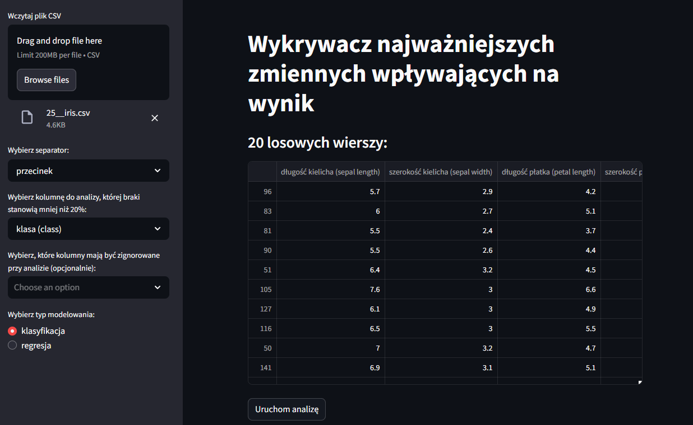
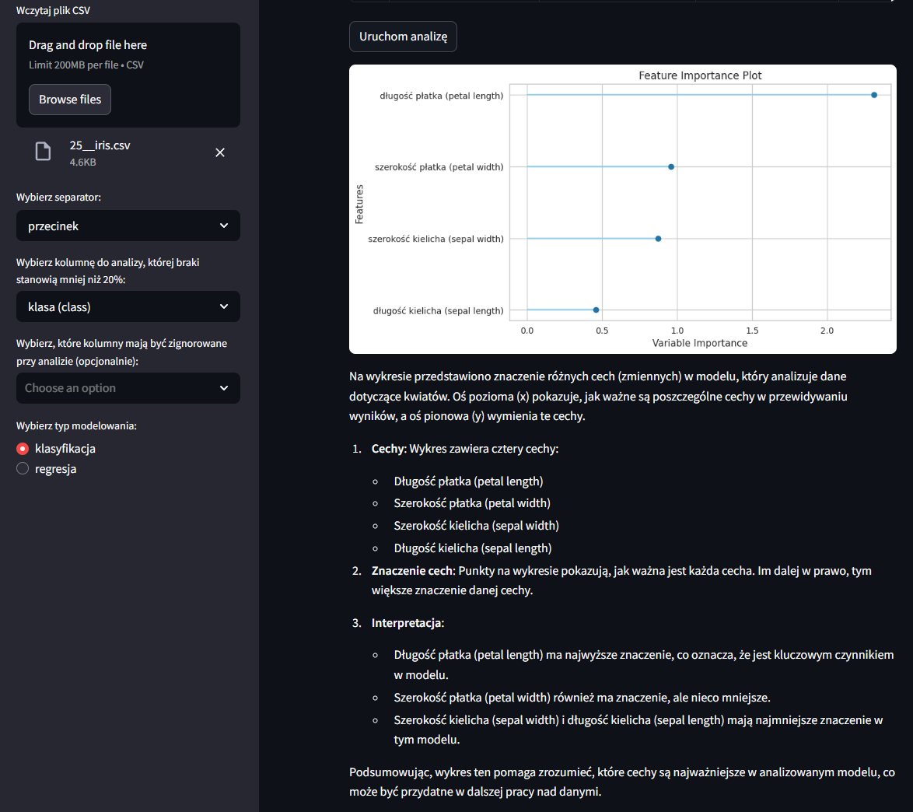
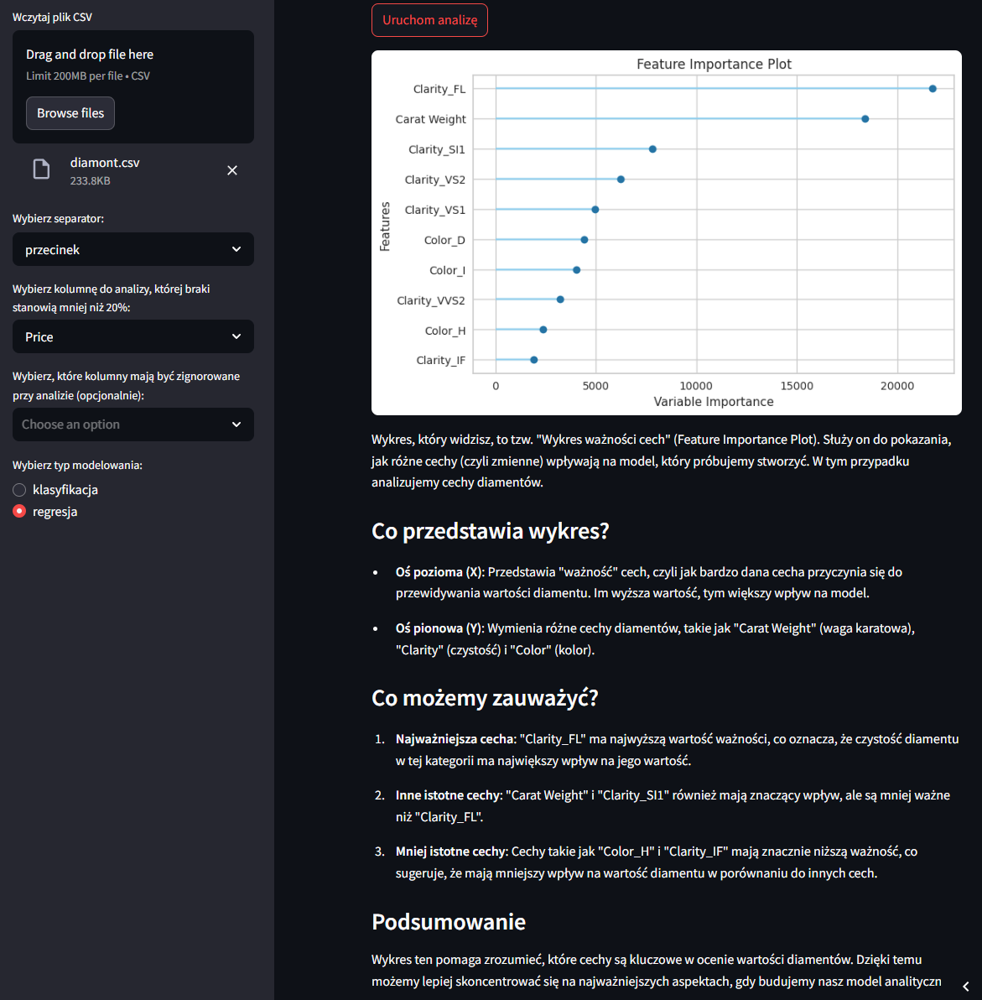

# Wykrywacz najważniejszej zmiennej wpływającej na wynik

Aplikacja pozwala na szybkie **znalezienie najważniejszych cech** w zbiorze danych wpływających na wynik.  
Kroki jakie musi wykonać użytkownik aplikacji to:  
<ul style="list-style-type: none; padding-left: 20px;">
<li>1. podać swój klucz API OpenAI;</li>
<li>2. załadować plik csv oraz wybrać separator;</li>  
<li>3. wybierać kolumnę do analizy (warunkiem jest jednak kompletność danych na poziomie 80%);</li>  
<li>4. opcjonalnie może zignorować część kolumn, ponieważ mogą one zakłamywać wyniki modelowania;</li>  
<li>5. wybrać typ modelowania - klasyfikację bądź regresję.</li>  
</ul>  
Po załadowaniu pliku csv użytkownik widzi **20 przykładowych wierszy**, co daje mu informację czy dobrze załadował plik.  
Po wciśnięciu przycisku **Uruchom analizę** aplikacja generuje wykres **Feature Importance Plot**, a następnie w przystępnym języku **interpretuje otrzymane wyniki**.  

**Link do aplikacji:** [Otwórz aplikację](https://wykrywaczistotnychzmiennych-jmk.streamlit.app/)  
  
Przykładowe zrzuty analiz:  

- **FUNKCJONALNA** działa sprawnie zapewniając użytkownikowi oczekiwane rezultaty
- **INTUICYJNA** użytkownik sam ustawia parametry
- **WYDAJNA** użytkownik natychmiast otrzymuje wynik, z krótkim i klarownym opisem

